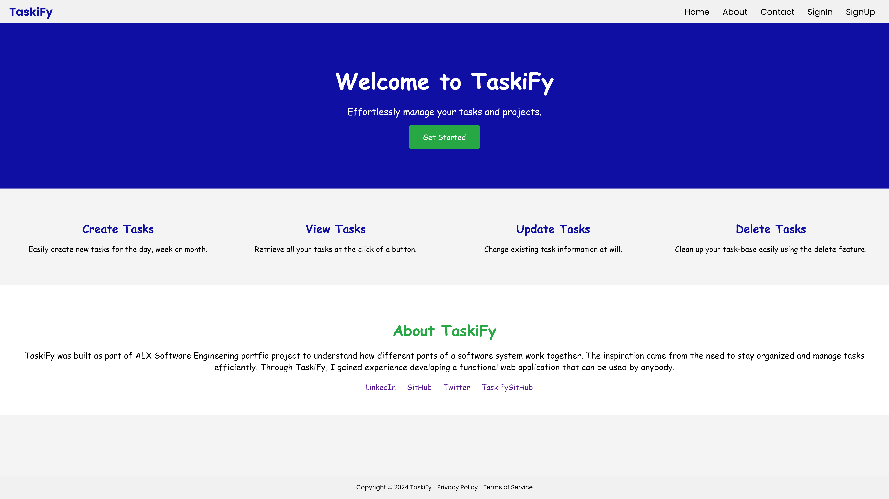
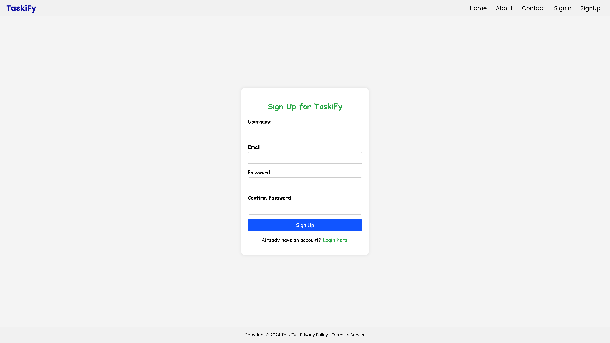

# Taskify

**Your Personal Task Management Solution**

## Table of Contents
- [Introduction](#introduction)
- [Project Structure](#project-structure)
- [API Endpoints](#api-endpoints)
- [Frontend](#frontend)

## Introduction
Taskify is a simple task management application designed to help users organize tasks and boost their productivity.

## Project Structure

```plaintext
.
├── README.md
├── api
│   ├── __init__.py
│   ├── app.py
│   ├── config.py
│   └── v1
│       ├── __init__.py
│       ├── models.py
│       └── routes
│           ├── __init__.py
│           ├── create.py
│           ├── delete.py
│           ├── login.py
│           ├── retrieve.py
│           ├── signup.py
│           └── update.py
├── frontend
│   ├── __init__.py
│   ├── app.py
│   ├── config.py
│   ├── static
│   │   ├── __init__.py
│   │   ├── css
│   │   │   ├── about.css
│   │   │   ├── contact.css
│   │   │   ├── create.css
│   │   │   ├── footer.css
│   │   │   ├── general.css
│   │   │   ├── header.css
│   │   │   ├── list.css
│   │   │   ├── login.css
│   │   │   └── signup.css
│   │   ├── images
│   │   │   ├── taskify-logo-big.PNG
│   │   │   └── taskify-logo-small.PNG
│   │   └── scripts
│   │       ├── create.js
│   │       ├── delete.js
│   │       ├── list.js
│   │       └── update.js
│   ├── templates
│   │   ├── about.html
│   │   ├── base.html
│   │   ├── contact.html
│   │   ├── home.html
│   │   ├── index.html
│   │   ├── login.html
│   │   └── signup.html
│   └── views
│       ├── __init__.py
│       ├── about.py
│       ├── contact.py
│       ├── home.py
│       ├── index.py
│       ├── login.py
│       ├── logout.py
│       └── signup.py
├── requirements.txt
├── taskify.db
└── tests
```

# API Endpoints

## User Endpoints
- **POST /api/v1/signup**: Sign up a new user.
- **POST /api/v1/login**: Log in an existing user.

## Task Endpoints
- **GET /api/v1/tasks**: Retrieve a list of all tasks.
- **GET /api/v1/tasks/<int:id>**: Retrieve a single task by ID.
- **POST /api/v1/tasks**: Create a new task.
- **PUT /api/v1/tasks/<int:id>**: Update an existing task.
- **DELETE /api/v1/tasks/<int:id>**: Delete a task.

# Frontend
The frontend provides a user-friendly interface to manage tasks effortlessly. It includes views for:

- Home

- About

- Contact

- Task Creation
- Task Listing

- User Login

- User Signup

